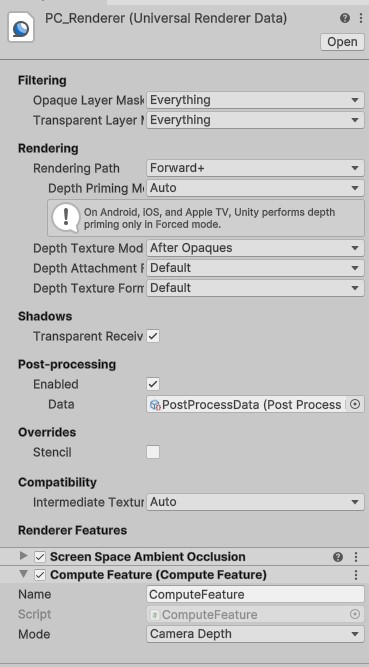

Render Features
====================================================================================================
This package provides a set of rendering features to demonstrate various GPU operations.

Linear Depth
------------------
The __Linear Depth Render Feature__ includes an integrated functionality for Unity 6 URP. 
It processes the main camera's depth texture, linearizes, and normalizes it, then displays the 
result in an editor window.

__Usage Instructions:__

- Create a new Unity 6 project.
- Open the Package Manager and install the UPM package from Git.
- The package includes a sample scene for demonstration purposes. Alternatively, you can create
  your own scene, ensuring the following prerequisites:
  - A camera with the "MainCamera" tag.
  - The "PC Renderer" component assigned to the camera's rendering settings.

Within the Settings folder of the package, you will find the PC Renderer. This renderer includes 
the Compute Feature required to activate the render pass.

The renderer provides a mode selection option to switch between:

The original depth texture from the camera.
- A linearized depth texture.
- A linear and normalized depth texture.

__Previewing the Output:__
To preview the depth image, navigate to Tools > Depth Capture in the Unity Editor and click 
__Capture Depth__. This action opens an editor window displaying the texture based on the selected mode.

